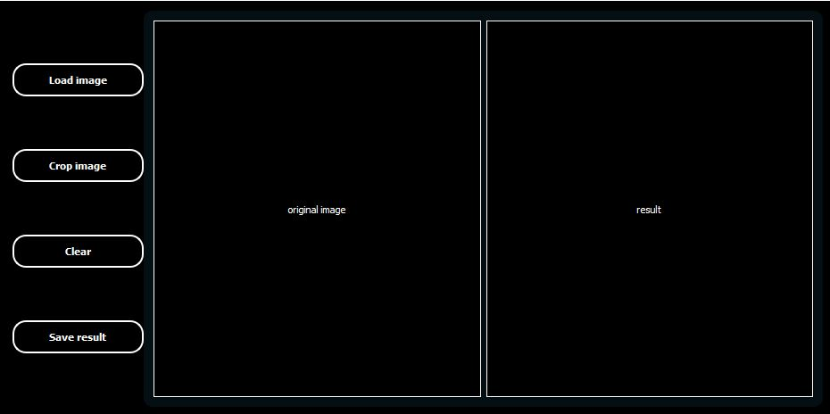
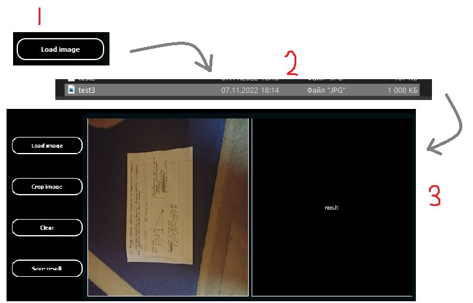
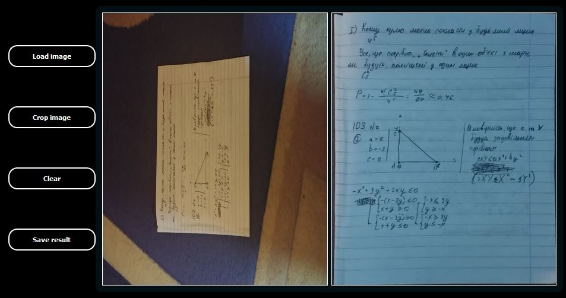

<!-- 
    Original template: 
    https://github.com/othneildrew/Best-README-Template/blob/master/README.md
-->

<a id="readme-top"></a>

<br />
<div align="center">
  <h3 align="center">Document detector</h3>

  <p align="center">
    A scanner, to find and crop documents from image
    <br />
    <br />
    <a href="https://github.com/Ptyg/Document-detector/tree/master/Document_detector/src">Code</a>
    |
    <a href="https://github.com/Ptyg/Document-detector/issues">Report Bug</a>
    |
    <a href="https://github.com/Ptyg/Document-detector/pulls">Request Feature</a>
  </p>
</div>

<p align="center">
  
  
  
</p>

<details>
  <summary>Table of Contents</summary>
  <ol>
    <li>
      <a href="#about-the-project">About The Project</a>
      <ul>
        <li><a href="#built-with">Built With</a></li>
      </ul>
    </li>
    <li>
      <a href="#getting-started">Getting Started</a>
      <ul>
        <li><a href="#prerequisites">Prerequisites</a></li>
        <li><a href="#installation">Installation</a></li>
      </ul>
    </li>
    <li><a href="#usage">Usage</a></li>
    <li><a href="#contributing">Contributing</a></li>
    <li><a href="#license">License</a></li>
    <li><a href="#contact">Contact</a></li>
  </ol>
</details>


## About The Project

How often do we need to scan documents: once a week, five times a month, ten times a year?
All options have one common characteristic - **we need a physical scanner**. 
Moreover, if we have nothing at our place, it can takes a lot of time to find one, 
go to that place and probably have to pay someone to scan our document. 
So in order to prevent all this i created an app where we can scan our document and 
get "cropped" version of it, like we printed it on a paper. **_And all for free_** :)

<p align="right">(<a href="#readme-top">back to top</a>)</p>

### Built With

* [![C++][cpp-shield]][cpp-url]
* [![OpenCV][opencv-shield]][opencv-url]
* [![Qt][qt-shield]][qt-url]
* [![Cmake][cmake-shield]][cmake-url]

<p align="right">(<a href="#readme-top">back to top</a>)</p>

## Getting Started

### Prerequisites

You need to have:

* Git: https://git-scm.com/download/win

* Cmake: https://cmake.org/download/

* Vcpkg: https://vcpkg.io/en/getting-started.html?platform=windows

And next system envs:
* VCPKG_ROOT - `{ path/to/vcpkg/dir }`
* PATH - `{ path/to/cmake/bin }`

### Installation

1. Create an empty directory wherever you want. It`s for repo cloning.

2. Clone the repo.
   ```sh
   git clone https://github.com/Ptyg/Document-detector.git
   ```
3. Open directory with cloned project in console.
    
    3.1 Type ... 
    ```sh
    cmake --list-presets
    ```

    ... to see all available presets. It is gonna looks like ...
    
    ```sh
    "preset_name#1" - preset_display_name#1
    "preset_name#2" - preset_display_name#2
    "preset_name#3" - preset_display_name#3 
    ...
    ```
    3.2 Choose a preset and type ...
    ```sh
    cmake --preset preset_name#1 (or cmake --preset preset_name#2, etc)
    ```

    3.3 Wait until project generation is done. It will locate at `./out/build/{ preset_name }`

__At the moment, only Visual Studio IDE is supported.__
<p align="right">(<a href="#readme-top">back to top</a>)</p>

## Usage

- After launch, you`ll see a window like this



- Choose an image with you document



- And click on `crop image` button 



Now you can  save the result or try to 'crop' another image.

<p align="right">(<a href="#readme-top">back to top</a>)</p>

## Contributing

If you have a suggestion that would make this better, please fork the repo and create a pull request.


1. Fork the Project
2. Create your Feature Branch (`git checkout -b { branch_name }`)
3. Commit your Changes (`git commit -m 'Add an amazing feature'`)
4. Push to the Branch (`git push origin { branch_name }`)
5. Open a Pull Request

<p align="right">(<a href="#readme-top">back to top</a>)</p>

## License

Distributed under the MIT License. See `LICENSE.txt` for more information.

<p align="right">(<a href="#readme-top">back to top</a>)</p>

## Contact

Gtyp - gtyp_local@proton.me

Project Link: [https://github.com/Ptyg/Document-detector](https://github.com/Ptyg/Document-detector)

<p align="right">(<a href="#readme-top">back to top</a>)</p>

## Get more info

* [OpenCV docs](https://docs.opencv.org/4.x/index.html)
* [Vcpkg docs](https://vcpkg.io/en/docs/README.html)
* [Qt docs](https://doc.qt.io/)

<p align="right">(<a href="#readme-top">back to top</a>)</p>

<!-- VARIABLES -->
[cpp-shield]: https://img.shields.io/static/v1?message=v%2011&color=blue&logo=C%2B%2B&logoColor=blue&label=C%2B%2B
[cpp-url]: https://en.cppreference.com/w/cpp/11

[opencv-shield]: https://img.shields.io/static/v1?message=v%204.6.0&color=c31d1d&logo=OpenCV&logoColor=red&label=OpenCV
[opencv-url]: https://opencv.org/

[qt-shield]: https://img.shields.io/static/v1?&message=v%205.15.6&color=19af4d&logo=Qt&logoColor=41CD12&label=Qt
[qt-url]: https://www.qt.io/

[cmake-shield]: https://img.shields.io/static/v1?message=v%203.25.1&color=7d8580&logo=cmake&logoColor=7d8580&label=Cmake
[cmake-url]: https://cmake.org/

